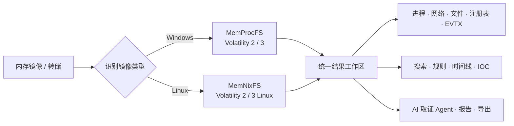

<p align="center">
  
</p>

<h1 align="center">Lovelymem V2</h1>

<p align="center">
  面向 Windows 的桌面内存取证工作台<br>
  将 MemProcFS、Volatility、MemNixFS、调查视图与 AI 取证 Agent 整合到统一界面
</p>

<p align="center">
  
  
  
  
  
</p>

<p align="center">
  <a href="#从-python-版到-v2">版本演进</a> ·
  <a href="#核心能力">核心能力</a> ·
  <a href="#快速开始">快速开始</a> ·
  <a href="#工具链配置">工具链配置</a> ·
  <a href="#目录结构">目录结构</a> ·
  <a href="#数据网络与安全边界">安全边界</a> ·
  <a href="#第三方工具与许可证">许可证</a>
</p>

> [!IMPORTANT]
> 当前 `v2` 分支仍在持续整理中。应用重点支持 Windows x64；文中的 Linux 支持是指分析 Linux 内存镜像，并不代表桌面客户端已完整支持 Linux 运行。

## 项目简介

Lovelymem V2 是一款基于 Rust、Tauri 2 与原生 TypeScript 构建的内存取证桌面应用。它把镜像加载、工具执行、结构化结果查看、证据检索、时间线调查、规则分析和报告整理集中在同一个工作区，减少在命令行、CSV 文件和多个查看器之间反复切换的成本。

项目不会把第三方取证引擎打包进仓库。你可以在设置中配置已有工具路径，也可以在 Windows x64 上从对应官方来源一键下载受支持的工具链。

## 从 Python 版到 V2

Lovelymem V2 延续了旧版 [LovelyMem Python](https://github.com/Tokeii0/LovelyMem) 的取证思路，但不是一次简单的界面换皮：运行底座、页面组织、工具准备和调查工作流都已重新构建。

| 维度 | Python 版 | Lovelymem V2 |
| --- | --- | --- |
| 技术底座 | Python 3.10 + PySide6 / Qt | Rust 2024 + Tauri 2 + TypeScript |
| 页面组织 | 单个 Qt 主窗口集中承载主要功能区 | 多页面工作台与独立调查视图 |
| 取证引擎 | MemProcFS、Volatility 2 / 3，含 Linux 模式 | 保留原有引擎并加入 MemNixFS 工作流 |
| 工具准备 | 用户下载工具后手动维护 YAML 或设置路径 | 智能探测，6 项官方工具逐项或批量安装 |
| 结果查看 | Qt 标签页、CSV 表格与扩展工具 | 内嵌结果工作区与进程、网络、文件、注册表、EVTX 等专用视图 |
| AI 辅助 | 面向结果的自然语言分析与摘要 | 可浏览、检索并调用取证工具的可选 Agent |
| 双语 | 简中 / English，切换后需重启完整生效 | 简中 / English 运行时切换并同步主要窗口 |

完整的版本演进展示页位于 [pages/showcase.html](./pages/showcase.html)。运行 `npm run dev` 后访问 `http://127.0.0.1:14222/showcase.html` 即可预览。

## 核心能力

| 能力 | 说明 |
| --- | --- |
| Windows 内存取证 | 集成 MemProcFS、Volatility 2 与 Volatility 3，覆盖系统、进程、线程、模块、网络、文件、注册表、服务、驱动、内核对象及浏览器痕迹等分析维度。 |
| Linux 内存取证 | 通过 MemNixFS、Volatility 2 Linux 与 Volatility 3 Linux 分析 LiME、AVML、ELF 等 Linux 内存转储。 |
| 统一调查工作区 | 将 CSV 结果直接嵌入主界面，并提供进程树、网络连接、句柄、服务、模块、驱动、NTFS 文件树、注册表和 EVTX 等专用视图。 |
| 证据检索与时间线 | 支持高性能字符串搜索、文件工作区、进程关系视图、时间关系视图、Super Timeline 和 IOC 提取。 |
| 规则驱动分析 | 支持 YARA 扫描、规则校验、内置与外部告警规则，以及针对结构化结果的列提示和风险检查。 |
| AI 取证 Agent | 可选的工具调用 Agent，可协助文件浏览、搜索、CSV/注册表分析及 Volatility 调用；支持 OpenAI 兼容接口、Anthropic 和本地 Ollama 等用户自配提供商。 |
| 调查记录 | 提供 Markdown 报告编辑、日志查看、命令面板、任务取消和结果导出能力。 |
| 双语界面 | 可在设置中切换简体中文与 English，并同步更新应用窗口和主要工具页面。 |

### 独立取证工具

- 高性能字符串搜索
- EXIF 元数据查看与导出
- 内存镜像图片提取
- 图片隐写、通道与位平面分析
- Super Timeline 多源时间线
- 原始内存图像可视化与熵分析
- SQLite 只读查看器
- Hex 大文件分块查看器
- IOC 提取器
- 注册表 CSV 取证分析

## 工作流概览



## 快速开始

### 环境要求

- Windows 10/11 x64
- Git
- Node.js 20 或 `>=22` 与 npm（建议使用仍受维护的 LTS 版本）
- 最新 Rust stable，建议使用 `stable-x86_64-pc-windows-msvc`
- Microsoft C++ Build Tools 与 Windows SDK
- Microsoft Edge WebView2 Runtime

> [!NOTE]
> 仓库使用 Rust 2024 edition。仅运行 Vite 页面时不需要编译 Rust，但浏览器环境无法使用完整的 Tauri 后端能力。

### 安装与运行

```powershell
# 仅克隆 v2 分支；请替换为实际仓库地址
git clone --branch v2 --single-branch <repository-url>
Set-Location <repository-directory>

# 严格按照 package-lock.json 安装依赖
npm ci

# 启动完整桌面开发环境
npm run tauri dev
```

仅预览前端：

```powershell
npm run dev
```

Vite 默认监听 `http://127.0.0.1:14222`；可通过 `TAURI_DEV_HOST` 覆盖主机地址，端口固定为 `14222` 并启用了严格检查。请始终从仓库根目录运行 npm 命令；不要进入 `pages/` 后直接启动 Vite。

### 构建与检查

```powershell
# TypeScript 检查并构建前端到 dist/
npm run build

# 构建 Tauri 发布程序
npm run tauri build

# Rust 后端检查
Set-Location src-tauri
cargo check
cargo test
cargo clippy
```

当前 `bundle.active` 为 `false`，因此 `npm run tauri build` 主要生成发布可执行文件，不会自动生成 MSI 或 NSIS 安装包。

## 工具链配置

打开 **设置 → 工具链配置**，可以探测本机已有路径，也可以逐项或批量下载缺失工具。受管工具默认保存到：

```text
%APPDATA%\lovelymem-v2\
├── settings.json
└── tools\
    ├── python3\
    ├── python2\
    ├── memprocfs\
    ├── volatility2\
    ├── volatility2_plugin\
    ├── volatility3\
    └── memnixfs\
```

| 工具 | 一键下载 | 说明 |
| --- | :---: | --- |
| Python 3 | 支持 | 安装到应用受管目录，不修改系统 `PATH`。 |
| Python 2 | 支持 | 仅用于兼容 Volatility 2；该版本已停止维护，不应作为通用 Python 环境使用。 |
| MemProcFS | 支持 | 自动准备所需 Python 3 环境；挂载功能仍需手动安装 Dokany 2。 |
| Volatility 2 | 支持 | 自动准备 Python 2 并创建独立插件目录。 |
| Volatility 3 | 支持 | 自动准备 Python 3 和当前安装流程所需的固定依赖。 |
| MemNixFS | 支持 | Linux 内存取证工具；挂载功能仍需手动安装 WinFsp。 |
| DumpIt | 不支持 | 仅允许手动配置，请依据上游许可自行获取。 |

一键下载器会执行以下保护：

- 仅允许 HTTPS 和内置官方来源，校验重定向后的最终地址
- 下载完成后强制校验 SHA-256；官方元数据提供大小时同时核对文件大小
- 在暂存目录中安全解压，限制单文件、总大小和文件数量
- 验证工具入口与基本可用性后再切换到正式目录
- 安装失败时回滚已有受管工具，并自动同步成功安装的路径
- 不修改系统 `PATH`，不自动安装系统驱动
- 下载过程需要访问 Python、GitHub 和 PyPI 的官方服务

> [!WARNING]
> Python 2 已结束生命周期。Dokany 2 与 WinFsp 属于需要额外权限的系统组件，不会由应用自动安装。安装第三方工具前，请阅读确认框及上游发布包中的 `LICENSE` / `NOTICE`。

## 目录结构

```text
.
├── pages/                  # Vite 多页面 HTML 入口
├── public/assets/          # 前端静态资源
├── resources/              # 随应用使用的资源与示例脚本
├── scripts/                # 项目维护脚本
├── src/
│   ├── i18n/               # 中英文词典与运行时翻译
│   ├── modules/            # 工作区、查看器、设置与功能模块
│   ├── showcase/           # 版本演进宣传页的样式与交互
│   ├── css/                # 全局与组件样式
│   └── main.ts             # 前端编排入口
├── src-tauri/
│   ├── src/                # Rust 命令、取证引擎适配与系统能力
│   ├── icons/              # 应用图标
│   ├── Cargo.toml
│   └── tauri.conf.json
├── package.json
├── tsconfig.json
└── vite.config.ts          # 多页面入口与 14222 开发端口
```

### 技术栈

- **桌面框架：** Tauri 2
- **后端：** Rust、Tokio
- **前端：** TypeScript、Vite、多页面原生 DOM 模块
- **终端与编辑器：** xterm.js、Monaco Editor
- **数据与取证：** SQLite、EVTX、EXIF、YARA、PDB/PE 解析等 Rust 组件

## 数据、网络与安全边界

- 内存镜像解析、查看器和主要取证流程在本机执行。
- 工具链下载、符号获取以及用户主动配置的 AI 提供商会产生网络请求。
- AI Agent 可能把完成任务所需的提示词或选定证据内容发送到用户配置的服务；启用前请确认数据处理政策和授权范围。
- 用户配置的 AI API Key 当前会写入 `%APPDATA%\lovelymem-v2\settings.json`，请限制该文件的访问权限，不要上传或分享。
- 内存镜像、转储结果和日志可能包含凭据、密钥、个人信息及其他敏感数据，请使用受控目录并妥善清理导出结果。
- 仅应分析你拥有或已获得明确授权的设备、镜像和数据。

## 常见问题

<details>
<summary><strong>Cargo 报错：extern location ... does not exist</strong></summary>

这通常是旧的或不完整的 Rust 构建缓存导致的。清理后重新检查：

```powershell
Set-Location src-tauri
cargo clean
cargo check
```

</details>

<details>
<summary><strong>Vite 报错：Failed to load /src/main.ts</strong></summary>

请回到仓库根目录后运行 `npm run dev` 或 `npm run tauri dev`。Vite 的 root 已配置为 `pages/`，不应从 `pages/` 目录直接启动。

</details>

<details>
<summary><strong>14222 端口被占用</strong></summary>

关闭占用该端口的进程后重试。若确需改端口，必须同时修改 `vite.config.ts` 与 `src-tauri/tauri.conf.json`。

</details>

## 开发约定

- 前端新页面放入 `pages/`，并同步登记到 `vite.config.ts`。
- 前端模块放入 `src/modules/`；Rust 功能保持独立模块，并在 `src-tauri/src/lib.rs` 注册 Tauri 命令。
- 设置项必须同时更新前端设置模型、Rust 设置结构、默认值和同步逻辑。
- 不要提交内存镜像、调查结果、API 密钥、访问令牌或第三方二进制包。
- 提交前至少运行 `npm run build`、`cargo check` 与 `git diff --check`。

## 第三方工具与许可证

Lovelymem V2 调用或下载的第三方工具仍受各自许可证约束，不会自动转为本项目许可证。

| 组件 | 上游许可证 |
| --- | --- |
| Python 2 / 3 | PSF License |
| MemProcFS | AGPL-3.0；发布包中的部分组件可能采用其他许可证 |
| Volatility 2 | GPL-2.0 |
| Volatility 3 | Volatility Software License |
| MemNixFS | Apache-2.0 |
| DumpIt、Dokany、WinFsp | 以各自上游发布内容为准 |

MemProcFS 相关取证流程会传入 Elastic License 2.0 接受参数，以使用其内置 FindEvil YARA 规则；使用前请自行审阅对应条款。

> [!CAUTION]
> 仓库当前尚未提供项目级根目录 `LICENSE` 文件。在许可证补充前，请勿假定本项目代码可以自由复制、修改或再分发。

## 致谢

感谢以下项目及其社区提供的基础能力：

- [MemProcFS](https://github.com/ufrisk/MemProcFS)
- [Volatility 2](https://github.com/volatilityfoundation/volatility)
- [Volatility 3](https://github.com/volatilityfoundation/volatility3)
- [MemNixFS](https://github.com/MemNixFS/MemNixFS)
- [Tauri](https://tauri.app/)

---

<p align="center">用于合法授权场景下的内存取证、应急响应与安全研究。</p>
