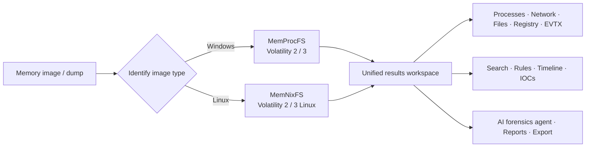

<p align="right">
  <a href="./README.md">简体中文</a> | <strong>English</strong>
</p>

<p align="center">
  
</p>

<h1 align="center">Lovelymem V2</h1>

<p align="center">
  A desktop memory forensics workbench for Windows<br>
  Bringing MemProcFS, Volatility, MemNixFS, investigation views, and an AI forensics agent into one interface
</p>

<p align="center">
  
  
  
  
  
  <a href="LICENSE"></a>
  <a href="https://github.com/Tokeii0/LovelyMem/actions/workflows/release.yml"></a>
  <a href="https://github.com/Tokeii0/LovelyMem/releases/latest"></a>
</p>

<p align="center">
  <a href="#evolution-from-the-python-version-to-v2">Evolution</a> ·
  <a href="#core-capabilities">Core capabilities</a> ·
  <a href="#quick-start">Quick start</a> ·
  <a href="#toolchain-configuration">Toolchain configuration</a> ·
  <a href="#repository-structure">Repository structure</a> ·
  <a href="#data-network-and-security-boundaries">Security boundaries</a> ·
  <a href="#project-license">License</a>
</p>

> [!IMPORTANT]
> `v2` is the primary branch for Lovelymem V2. Windows x64 users can download the standalone EXE from [Releases](https://github.com/Tokeii0/LovelyMem/releases). References to Linux support in this document mean analysis of Linux memory images; they do not mean that the desktop client is fully supported on Linux.

## Project Overview

Lovelymem V2 is a desktop memory forensics application built with Rust, Tauri 2, and native TypeScript. It brings image loading, tool execution, structured result viewing, evidence search, timeline investigation, rule-based analysis, and report preparation into a single workspace, reducing the need to switch repeatedly between command-line tools, CSV files, and multiple viewers.

The project does not bundle third-party forensic engines in the repository. You can configure paths to tools you already have in Settings or, on Windows x64, download supported tools from their respective official sources with one click.

## Evolution from the Python Version to V2

Lovelymem V2 continues the forensic approach of the earlier [LovelyMem Python](https://github.com/Tokeii0/LovelyMem/tree/v1), but it is more than a new interface: the runtime foundation, page organization, tool provisioning, and investigation workflow have all been rebuilt.

| Dimension | Python Version | Lovelymem V2 |
| --- | --- | --- |
| Technology foundation | Python 3.10 + PySide6 / Qt | Rust 2024 + Tauri 2 + TypeScript |
| Interface organization | A single Qt main window containing the primary feature areas | A multi-page workbench with dedicated investigation views |
| Forensic engines | MemProcFS and Volatility 2 / 3, including a Linux mode | Retains the existing engines and adds a MemNixFS workflow |
| Tool provisioning | Users download tools and maintain YAML files or configure paths manually | Intelligent detection, with individual or batch installation for six tools from official sources |
| Result viewing | Qt tabs, CSV tables, and auxiliary tools | An embedded results workspace with dedicated views for processes, network activity, files, the registry, EVTX, and more |
| AI assistance | Natural-language analysis and summaries of results | An optional agent that can browse, search, and invoke forensic tools |
| Bilingual interface | Simplified Chinese / English; a restart is required for all changes to take effect | Runtime switching between Simplified Chinese / English, synchronized across the main application windows |

## Core Capabilities

| Capability | Description |
| --- | --- |
| Windows memory forensics | Integrates MemProcFS, Volatility 2, and Volatility 3 for analysis of systems, processes, threads, modules, network activity, files, the registry, services, drivers, kernel objects, browser artifacts, and more. |
| Linux memory forensics | Analyzes LiME, AVML, ELF, and other Linux memory dumps through MemNixFS, Volatility 2 Linux, and Volatility 3 Linux. |
| Unified investigation workspace | Embeds CSV results directly in the main interface and provides dedicated views for process trees, network connections, handles, services, modules, drivers, NTFS file trees, the registry, EVTX, and more. |
| Evidence search and timelines | Provides high-performance string search, a file workspace, process-relationship and temporal-relationship views, Super Timeline, and IOC extraction. |
| Rule-driven analysis | Supports YARA scanning, rule validation, built-in and external alert rules, column hints, and risk checks for structured results. |
| AI forensics agent | An optional tool-calling agent that can assist with file browsing, search, CSV and registry analysis, and Volatility invocation. It supports user-configured providers such as OpenAI-compatible endpoints, Anthropic, and local Ollama. |
| Investigation records | Provides Markdown report editing, log viewing, a command palette, task cancellation, and result export. |
| Bilingual interface | Switches between Simplified Chinese and English in Settings, with synchronized updates across the application windows and primary tool pages. |

### Standalone Forensic Tools

- High-performance string search
- EXIF metadata viewing and export
- Image extraction from memory images
- Image steganography, channel, and bit-plane analysis
- Multi-source Super Timeline
- Raw memory image visualization and entropy analysis
- Read-only SQLite viewer
- Chunked hex viewer for large files
- IOC extractor
- Forensic analysis of registry CSV data

## Workflow Overview



## Quick Start

### Requirements

- Windows 10/11 x64
- Git
- Node.js 20 or `>=22`, with npm (use a currently maintained LTS release where possible)
- The latest stable Rust toolchain; `stable-x86_64-pc-windows-msvc` is recommended
- Microsoft C++ Build Tools and the Windows SDK
- Microsoft Edge WebView2 Runtime

> [!NOTE]
> This repository uses Rust 2024 edition. Rust compilation is not required if you only run the Vite pages, but the browser environment cannot access the full Tauri backend functionality.

### Install and Run

```powershell
# Clone only the v2 branch; replace this with the actual repository URL
git clone --branch v2 --single-branch <repository-url>
Set-Location <repository-directory>

# Install dependencies exactly as specified by package-lock.json
npm ci

# Start the complete desktop development environment
npm run tauri dev
```

To preview only the frontend:

```powershell
npm run dev
```

By default, Vite listens on `http://127.0.0.1:14222`. You can override the host address with `TAURI_DEV_HOST`; port `14222` is fixed and strict port checking is enabled. Always run npm commands from the repository root. Do not start Vite directly from `pages/`.

### Build and Check

```powershell
# Type-check TypeScript and build the frontend into dist/
npm run build

# Build the Tauri release application
npm run tauri build

# Check and test the Rust backend
Set-Location src-tauri
cargo check
cargo test
cargo clippy
```

The current value of `bundle.active` is `false`. As a result, `npm run tauri build` primarily produces a release executable; it does not automatically generate MSI or NSIS installers.

## Toolchain Configuration

Open **Settings → Toolchain Configuration** to detect existing local paths or download missing tools individually or in a batch. Managed tools are stored by default in:

```text
%APPDATA%\lovelymem-v2\
├── settings.json
└── tools\
    ├── python3\
    ├── python2\
    ├── memprocfs\
    ├── volatility2\
    ├── volatility2_plugin\
    ├── volatility3\
    └── memnixfs\
```

| Tool | One-click download | Notes |
| --- | :---: | --- |
| Python 3 | Supported | Installed in the application's managed directory without modifying the system `PATH`. |
| Python 2 | Supported | Used only for Volatility 2 compatibility. This version is end-of-life and should not be used as a general-purpose Python environment. |
| MemProcFS | Supported | Automatically provisions the required Python 3 environment. Mounting still requires Dokany 2 to be installed manually. |
| Volatility 2 | Supported | Automatically provisions Python 2 and creates a separate plugin directory. |
| Volatility 3 | Supported | Automatically provisions Python 3 and the pinned dependencies required by the current installation process. |
| MemNixFS | Supported | A Linux memory forensics tool. Mounting still requires WinFsp to be installed manually. |

The one-click downloader applies the following safeguards:

- Allows only HTTPS and built-in official sources, and validates the final URL after redirects
- Enforces SHA-256 verification after download and also checks file size when official metadata provides it
- Safely extracts archives in a staging directory, with limits on individual file size, total size, and file count
- Verifies tool entry points and basic functionality before promoting an installation to the final directory
- Restores an existing managed tool if installation fails, and automatically synchronizes paths for successfully installed tools
- Does not modify the system `PATH` or automatically install system drivers
- Requires network access to official Python, GitHub, and PyPI services during downloads

> [!WARNING]
> Python 2 has reached end-of-life. Dokany 2 and WinFsp are system components that require additional privileges and are not installed automatically by the application. Before installing any third-party tool, review the confirmation dialog and the `LICENSE` / `NOTICE` files included in the upstream distribution.

## Repository Structure

```text
.
├── pages/                  # Vite multi-page HTML entry points
├── public/assets/          # Static frontend assets
├── resources/              # Application resources and example scripts
├── scripts/                # Project maintenance scripts
├── src/
│   ├── i18n/               # Chinese and English dictionaries and runtime translation
│   ├── modules/            # Workspace, viewers, settings, and feature modules
│   ├── showcase/           # Styles and interactions for the version-evolution showcase
│   ├── css/                # Global and component styles
│   └── main.ts             # Frontend orchestration entry point
├── src-tauri/
│   ├── src/                # Rust commands, forensic engine adapters, and system capabilities
│   ├── icons/              # Application icons
│   ├── Cargo.toml
│   └── tauri.conf.json
├── package.json
├── tsconfig.json
└── vite.config.ts          # Multi-page entries and development port 14222
```

### Technology Stack

- **Desktop framework:** Tauri 2
- **Backend:** Rust and Tokio
- **Frontend:** TypeScript, Vite, and native DOM modules in a multi-page application
- **Terminal and editor:** xterm.js and Monaco Editor
- **Data and forensics:** Rust components for SQLite, EVTX, EXIF, YARA, PDB/PE parsing, and more

## Data, Network, and Security Boundaries

- Memory image parsing, viewers, and the primary forensic workflows run locally.
- Toolchain downloads, symbol retrieval, and user-configured AI providers generate network requests.
- The AI agent may send prompts or selected evidence required to complete a task to a user-configured service. Before enabling it, confirm the service's data-processing policy and the scope of your authorization.
- User-configured AI API keys are currently written to `%APPDATA%\lovelymem-v2\settings.json`. Restrict access to this file, and do not upload or share it.
- Memory images, dump results, and logs may contain credentials, keys, personal information, and other sensitive data. Use controlled directories and securely dispose of exported results.
- Analyze only devices, images, and data that you own or are explicitly authorized to examine.

## Troubleshooting

<details>
<summary><strong>Cargo error: extern location ... does not exist</strong></summary>

This is usually caused by a stale or incomplete Rust build cache. Clean the cache and check again:

```powershell
Set-Location src-tauri
cargo clean
cargo check
```

</details>

<details>
<summary><strong>Vite error: Failed to load /src/main.ts</strong></summary>

Return to the repository root, then run `npm run dev` or `npm run tauri dev`. Vite's root is configured as `pages/`, so do not start it directly from the `pages/` directory.

</details>

<details>
<summary><strong>Port 14222 is already in use</strong></summary>

Stop the process using that port and try again. If you must change the port, update both `vite.config.ts` and `src-tauri/tauri.conf.json`.

</details>

## Project License

The Lovelymem V2 project code is licensed under the [GNU Affero General Public License v3.0](./LICENSE), with the SPDX identifier `AGPL-3.0-only`. When using, modifying, deploying, or redistributing this project, comply with the complete license terms.

## Acknowledgements

We thank the following projects and their communities for providing the capabilities on which Lovelymem V2 builds:

- [MemProcFS](https://github.com/ufrisk/MemProcFS)
- [Volatility 2](https://github.com/volatilityfoundation/volatility)
- [Volatility 3](https://github.com/volatilityfoundation/volatility3)
- [MemNixFS](https://github.com/MemNixFS/MemNixFS)
- [Tauri](https://tauri.app/)

---

<p align="center">For memory forensics, incident response, and security research in lawful, authorized contexts.</p>
